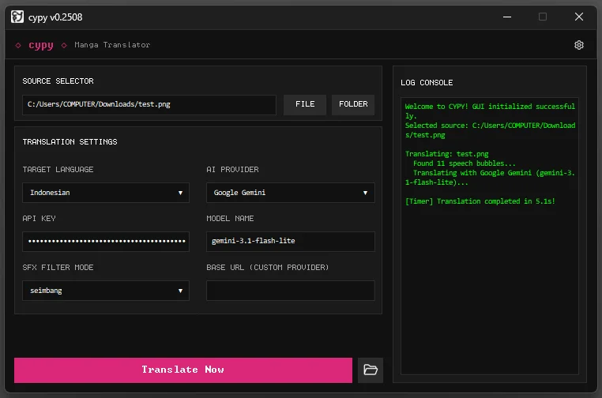

# cypy

<p align="center">
  
</p>

<p align="center">
  
</p>

---

**cypy** is a modern manga translator application utilizing YOLOv8 to accurately detect speech bubbles and Google Gemini API / OpenAI API to translate comic panels while keeping original artwork clean and typography well-fitted.

The application offers two operation modes:
- **GUI Mode:** A sleek, pitch-black retro graphical interface featuring Consolas monospace font, pixel-perfect 1px borders, and full **Drag & Drop** support.
- **CLI Mode:** An interactive command-line interface for fast and efficient translation directly from your terminal.

### Translation Example (Before / After)

| Original Page (Before) | Translated Page (After) |
| :---: | :---: |
|  |  |

### Features

- **Drag & Drop Support (GUI / CLI):** Drag any manga files (Images, PDF, ZIP, CBZ, RAR, CBR) or directories and drop them directly onto the GUI window or terminal prompt to automatically populate the source path.
- **On-the-Fly Configuration (GUI / CLI):** Switch target languages, LLM models, and AI providers on the fly, or tweak bubble layout padding and font scales dynamically.
- **Smart Hybrid Storage:**
  - **Portable Mode:** Saves your configuration to `./data/settings.json` when run from local writable folders.
  - **Installed Mode:** Automatically redirects settings to `%LOCALAPPDATA%/cypy/settings.json` if run from protected system folders (like `Program Files`) to prevent permission errors and preserve preferences during upgrades.
- **Multi-Language Translation:** Translate manga to English, Indonesian, Japanese, Mandarin, Spanish, Portuguese, Javanese, Korean, Russian, and Thai.
- **Multi-Provider AI Engines:** Out-of-the-box support for **Google Gemini**, **OpenAI**, **Zen** (free, no API key required), **OpenCode Go**, **OpenRouter**, and **Custom Provider** (OpenAI-compatible base URL & custom model).
- **Official Publisher Metadata:** Built Windows executables (`.exe`) are dynamically stamped with publisher properties (**indravoyager**).

### Installation & Setup

#### Prerequisites
- **Python:** Version `3.8` to `3.11` (Python `3.10` recommended).

#### Step 1: Clone the Repository & Prepare Virtual Environment
```bash
# 1. Clone cypy repository
git clone https://github.com/indravoyager/cypy.git
cd cypy

# 2. Create virtual environment
python -m venv venv

# 3. Activate the virtual environment
# Windows:
venv\Scripts\activate
# Linux / macOS:
source venv/bin/activate
```

#### Step 2: Install Dependencies & Application
```bash
pip install -e .
```

#### Step 3: Run the Application
Once installed, you can use the registered shortcut command `cypy` directly from your terminal:
- **GUI Mode (Recommended / Default):**
  Running `cypy` without arguments defaults to GUI mode.
  ```bash
  cypy
  ```
- **CLI Mode (Interactive Terminal):**
  Use the `--cli` flag to start in terminal mode.
  ```bash
  cypy --cli
  ```

### Interactive CLI Commands

When running in **CLI Mode**, you can type these commands directly in the prompt before dropping your files:

| Command | Description |
| :--- | :--- |
| `lang` / `switch` | Dynamically select/change the target translation language. |
| `provider` / `api` | Choose/switch the active LLM provider (Gemini, OpenAI, Zen, etc.). |
| `model` | Instantly change the active LLM model name. |
| `status` | Display current API key status and configurations. |
| `tweak` | Open the layout tweak menu to adjust padding margins, font scales, etc. |
| `help` | Print list of available commands. |
| `stop` / `exit` | Exit the application. |

### Compiling Standalone Executable (.exe)
To package `cypy` into a standalone Windows executable (`.exe`) stamped with the **indravoyager** metadata, run:
```bash
python build.py
```

---

## License

[MIT](LICENSE)
